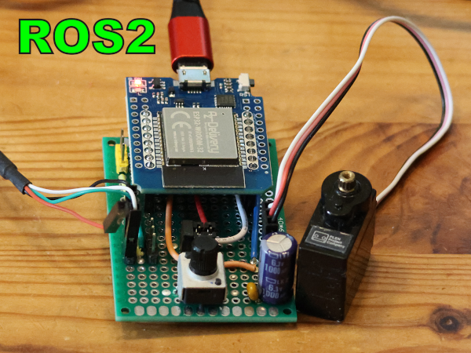

# ROS2 nodes for ESP32 with potentiometer (sensor) and servo (actuator)

## Some infos

I will use a simple ESP32 circuit (Arduino) with potentiometer (sensor) and servo (actuator) and create two ROS2 nodes to access these.

## All infos on: <https://www.weigu.lu/sb-computer/ros2_basics/ros2_esp32_pot_servo/index.html>

**For more information about ROS2:** <https://www.weigu.lu/sb-computer/ros2_basics/index.html>

